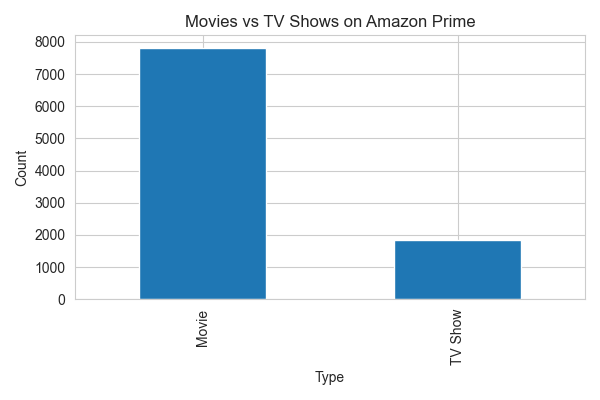
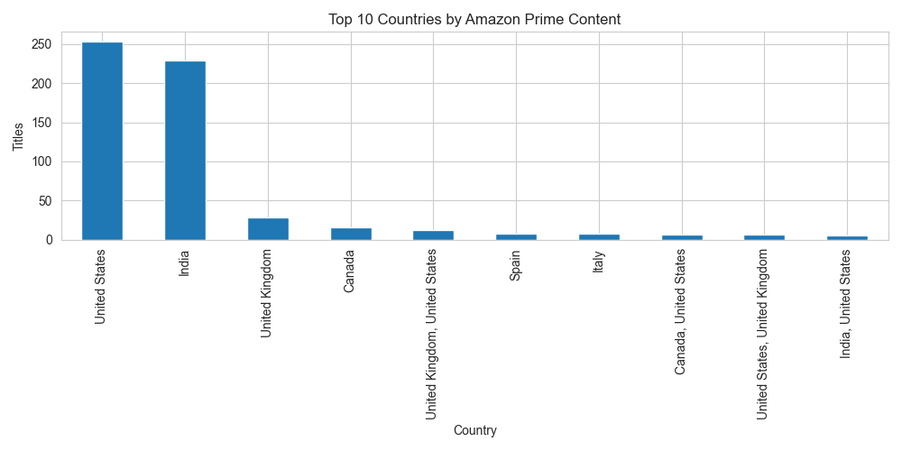
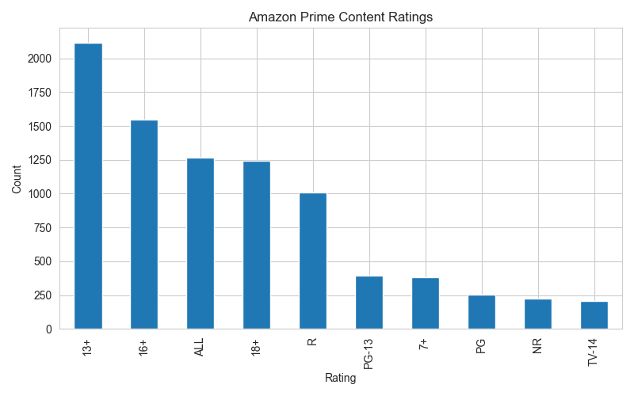
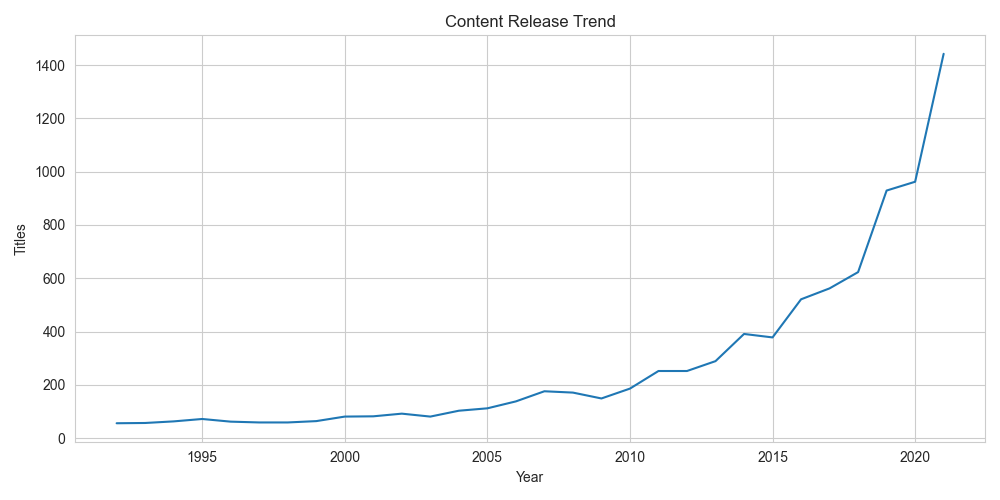
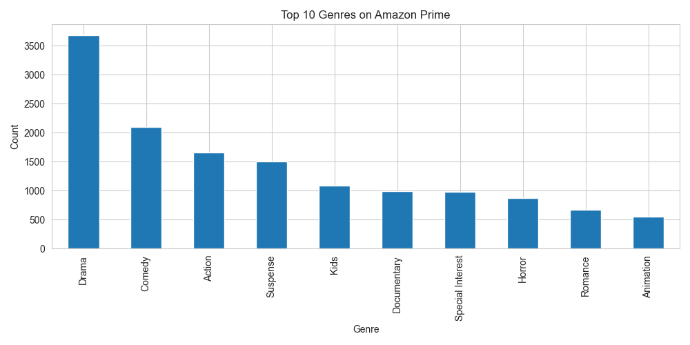

# 📊 Amazon Prime Data Visualization


## 👨‍💻 Author

<h1>SHAIK ABDUL SAMEER</h1>

Python Developer | Data Analytics Enthusiast | AI/ML Aspirant

---

## 📖 Project Overview

This project focuses on Data Visualization using the Amazon Prime Titles Dataset.

The objective is to analyze Amazon Prime content and discover meaningful insights through visual representations. Various charts and graphs were created to understand content distribution, ratings, countries, genres, and release trends.

---

## 🎯 Project Objectives

* Analyze Amazon Prime Movies and TV Shows
* Identify top content-producing countries
* Explore content ratings distribution
* Visualize release year trends
* Discover the most popular genres
* Create professional visualizations for data-driven insights

---

## 🛠 Technologies Used

* Python
* Pandas
* Matplotlib
* Seaborn
* VS Code
* Git & GitHub

---

## 📂 Dataset

Dataset: Amazon Prime Titles Dataset

The dataset contains information about movies and TV shows available on Amazon Prime, including:

* Title
* Type
* Country
* Rating
* Release Year
* Genre
* Director
* Cast

---

## 📊 Project Visualizations

### 1️⃣ Movies vs TV Shows Analysis


### 2️⃣ Top 10 Countries by Content


### 3️⃣ Ratings Distribution Analysis


### 4️⃣ Release Year Trend Analysis


### 5️⃣ Top Genres Analysis


---

---

## 🔍 Key Insights

* Movies dominate the Amazon Prime platform.
* Certain countries contribute significantly more content than others.
* Content ratings are concentrated in a few major categories.
* Content production increased rapidly in recent years.
* Drama and entertainment-related genres are highly popular.

---

## 📁 Project Structure

```text
CodeAlpha_AmazonPrime_DataVisualization
│
├── amazon_prime_titles.csv
├── visualization.py
├── README.md
├── requirements.txt
├── movies_vs_tvshows.png
├── top_10_countries.png
├── ratings_distribution.png
├── release_year_trend.png
└── top_genres.png
```

## ▶️ How to Run

### Install Required Libraries

```bash
pip install pandas matplotlib seaborn
```

### Run the Project

```bash
python visualization.py
```

---

## 📸 Project Output

The project generates the following visualizations:

* Movies vs TV Shows Chart
* Top 10 Countries Chart
* Ratings Distribution Chart
* Release Year Trend Chart
* Top Genres Chart

---

## 🚀 Internship Task

This project was completed as part of the **CodeAlpha Data Analytics Internship Program**.

---

## ⭐ GitHub Repository

If you found this project useful, feel free to star the repository and connect with me on LinkedIn.

Thank you for visiting this project!
